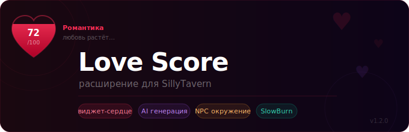

# ❤️ Love Score — расширение для SillyTavern

Отслеживает очки любви между игроком и персонажем прямо во время чата. Виджет-сердечко висит поверх интерфейса и заполняется по мере роста отношений. Все правила, диапазоны поведения и романтические события генерирует AI — тебе нужно только нажать кнопку.

---

## 📦 Установка

1. Открой SillyTavern → **Расширения** → **Установить расширение**
2. Вставь ссылку на репозиторий:
   ```
   https://github.com/KiskaSora/love-score
   ```
3. Нажми **Установить** и перезагрузи страницу
4. Панель ❤️ Love Score появится в боковой панели расширений

---

## 🚀 Быстрый старт

1. Открой чат с персонажем
2. Перейди в **Расширения → ❤️ Love Score**
3. Во вкладке **AI генерация** укажи Endpoint и API Key любого OpenAI-совместимого API
4. Нажми **Сгенерировать** — расширение прочитает карточку персонажа и автоматически заполнит все правила, диапазоны и события
5. Начни общаться — виджет обновляется сам после каждого ответа бота

---

## ✨ Возможности

### ♥ Виджет-сердечко
Плавающее сердце поверх интерфейса. Заполняется по мере роста очков, меняет цвет в зависимости от типа отношений, переворачивается при уходе в минус. Можно перетаскивать, менять размер. Два стиля: **заливка** (SVG) и **размытое** (Blur).

### 📊 Раздельные данные по чатам
Каждый чат хранит собственные очки, правила и историю независимо от других.

### ⚖️ Правила изменений
Задай, за что очки растут и падают — с произвольными значениями дельты и текстовым описанием условия. Эти правила инжектируются в системный промпт и направляют поведение AI.

### 🎭 Диапазоны поведения
Опиши, как ведёт себя персонаж при разных значениях счёта. Активный диапазон автоматически добавляется в промпт, заставляя бота играть роль точнее.

### 💫 Романтические события
Задай пороги, при достижении которых персонаж должен сам инициировать особый момент. Расширение отмечает их выполненными, когда бот включает нужный тег в ответ.

### 🤖 AI генерация
Подключи любой OpenAI-совместимый API и одним кликом сгенерируй правила, диапазоны и события — специально под конкретного персонажа. Поддерживает историю чата для более точного результата.

Настраиваемые секции генерации:
- Правила изменений
- Позитивные диапазоны (0 … макс)
- Негативные диапазоны (−100 … −1)
- Романтические события
- Предложение максимального счёта

### 🔄 Авто-регенерация
Каждые N сообщений AI автоматически пересоздаёт все правила на основе актуальной истории чата — они остаются живыми и точными на протяжении всей истории.

### 🔍 Анализ чата
AI читает историю и карточку персонажа и предлагает актуальный счёт отношений с объяснением.

### 👥 Режим окружения (NPC)
Отслеживай отношения сразу с несколькими персонажами. Добавляй NPC вручную, из лорбука или через автосканирование чата. Каждый NPC имеет свой счёт, тип отношений и полосу прогресса.

### 🌍 SlowBurn
Режим замедленного развития: изменение счёта ограничено ±2 за один ответ (если только не срабатывает точное правило). Создаёт ощущение постепенного, реалистичного развития отношений.

### 💾 Пресеты
Сохраняй и загружай наборы правил. Перед каждой генерацией автоматически создаётся снапшот — легко откатиться назад. Импорт и экспорт через JSON.

### 🔗 Лорбук как источник данных
Помимо карточки персонажа, AI может использовать записи из лорбука — выбирай нужные записи прямо в интерфейсе.

### 🐛 Отладка
Вкладка с полным промптом-инжектом, текущим состоянием, NPC и тегами для AI — удобно для диагностики.

---

## 🤖 Как бот читает счёт

Расширение добавляет скрытый системный блок в каждое сообщение. Бот включает специальные теги в конце каждого ответа:

```
<!-- [LOVE_SCORE:47] -->
```

Когда выполняется романтическое событие:
```
<!-- [MILESTONE:30] -->
```

Когда определился тип отношений:
```
<!-- [RELATION_TYPE:romance] -->
```

В режиме окружения — для NPC:
```
<!-- [NPC_SCORE:Alice:23] -->
<!-- [NPC_TYPE:Alice:friendship] -->
```

Расширение автоматически обнаруживает эти теги и обновляет виджет.

---

## 💔 Типы отношений

| Тип | Цвет | Описание |
|---|---|---|
| Романтика | 🔴 | Влюблённость, страсть, нежность |
| Дружба | 🟠 | Тепло и доверие без романтики |
| Семья | 🟡 | Глубокая привязанность |
| Платоника | 🟢 | Духовная близость без физики |
| Соперник | 🔵 | Уважение через конкуренцию |
| Одержимость | 🟣 | Тёмная, болезненная фиксация |
| Ненависть | ⚫ | Враждебность (сердце переворачивается) |

---

## 🗂️ Структура проекта

```
love-score/
├── index.js      — точка входа, инициализация
├── config.js     — константы, настройки, аксессоры данных
├── heart.js      — виджет: SVG и Blur сердце, анимации
├── prompt.js     — построение промпта, обработка сообщений
├── ai.js         — AI генерация, анализ, лорбук, NPC
├── state.js      — пресеты и снапшоты
├── ui.js         — стили, HTML панели, syncUI, события
├── manifest.json
└── README.md
```

---

## 🔧 Совместимость

Работает с любым OpenAI-совместимым API: OpenAI, OpenRouter, LM Studio, Ollama, KoboldCPP и другими.

---

*Сделано с ❤️ для SillyTavern*
