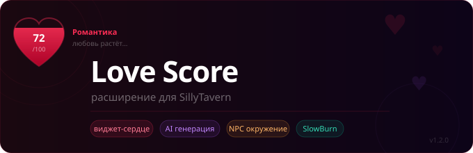

**🇷🇺 Русский** · [🇬🇧 English](README.en.md)

# ❤️ Love Score — расширение для SillyTavern

Отслеживает очки любви между игроком и персонажем прямо во время чата. Виджет-сердечко висит поверх интерфейса и заполняется по мере роста отношений. Все правила, диапазоны поведения и романтические события генерирует AI — тебе нужно только нажать кнопку.

---

## 📦 Установка

1. Открой SillyTavern → **Расширения** → **Установить расширение**
2. Вставь ссылку на репозиторий:
   ```
   https://github.com/KiskaSora/love-score.git
   ```
3. Нажми **Установить** и перезагрузи страницу
4. Значок 🪄 (**Magic Wand**) над полем ввода → **❤️ Love Score** откроет окно управления

---

## 🚀 Быстрый старт

1. Открой чат с персонажем
2. Нажми значок 🪄 (**Magic Wand**) над полем ввода и выбери **❤️ Love Score** — откроется окно управления
3. Во вкладке **AI** укажи Endpoint и API Key любого OpenAI-совместимого API
4. Нажми **Сгенерировать** — расширение прочитает карточку персонажа и автоматически заполнит все правила, диапазоны и события
5. Начни общаться — виджет обновляется сам после каждого ответа бота

> **Где находится панель?** Начиная с версии 1.7.0 всё управление переехало из боковой панели настроек в **wand-меню** (🪄 над полем ввода) и открывается в отдельном адаптивном окне — удобно и на ПК, и на телефоне. Виджет-сердечко остаётся плавающим поверх чата. **Двойной тап/клик** по сердечку тоже открывает окно.

---

## 🗂 Окно управления

Сверху — живая шапка со счётом, стрелкой тренда и мини-графиком (видна с любой вкладки). Ниже — горизонтальные вкладки:

| Вкладка | Что внутри |
|---|---|
| **Обзор** | Текущий счёт, тип отношений, что персонаж отыгрывает сейчас, история изменений, график динамики, шрамы |
| **Режимы** | Игровые режимы (SlowBurn, Hardcore, Холодный старт, Шрамы, Серия, Импульс) + блок «Вид и инжект»: размер и стиль сердца, тон инжекта, скрытые правила, обоснование в логе |
| **Правила** | Правила изменений, поведение по диапазонам, романтические события, маршруты |
| **AI** | Генерация правил, анализ чата, авто-регенерация, источники данных (карточка/лорбук), язык генерации |
| **Окружение** | Режим NPC: несколько персонажей сразу, соперники за внимание |
| **Пресеты** | Сохранение/загрузка наборов правил, импорт/экспорт через JSON |
| **Отладка** | Полный промпт-инжект, текущее состояние, теги для AI |

---

## ✨ Возможности

### ♥ Виджет-сердечко
Плавающее сердце поверх интерфейса. Заполняется по мере роста очков, меняет цвет в зависимости от типа отношений, переворачивается при уходе в минус. Можно перетаскивать, менять размер. Два стиля: **заливка** (SVG) и **размытое** (Blur). **Одиночный тап** показывает подсказку (тип отношений и текущее поведение), **двойной тап/клик** открывает окно управления (можно отключить во вкладке **Режимы**).

### 🌐 Двуязычный интерфейс
Интерфейс автоматически подстраивается под язык SillyTavern: по-русски по умолчанию, на английском — если в таверне выбран любой не-русский язык (en, ja, de, fr…). Отдельно настраивать ничего не нужно — расширение читает языковую настройку таверны само.

### 📊 Раздельные данные по чатам
Каждый чат хранит собственные очки, правила и историю независимо от других.

### ⚖️ Правила изменений
Задай, за что очки растут и падают — с произвольными значениями дельты и текстовым описанием условия. Эти правила инжектируются в системный промпт и направляют поведение AI.

### 🎭 Диапазоны поведения
Опиши, как ведёт себя персонаж при разных значениях счёта. Активный диапазон автоматически добавляется в промпт, заставляя бота играть роль точнее.

### 💫 Романтические события
Задай пороги, при достижении которых персонаж должен сам инициировать особый момент. Расширение отмечает их выполненными, когда бот включает нужный тег в ответ. Порог можно растянуть кнопкой **«Сгенерировать события … до N»** — хоть до очень больших значений, если хочешь, чтобы бот удивлял тебя ещё долго.

### 🤖 AI генерация
Подключи любой OpenAI-совместимый API и одним кликом сгенерируй правила, диапазоны и события — специально под конкретного персонажа. Поддерживает историю чата и выбор языка генерации (RU/EN) для более точного результата.

Настраиваемые секции генерации:
- Правила изменений
- Позитивные диапазоны (0 … макс)
- Негативные диапазоны (−100 … −1)
- Романтические события
- Предложение максимального счёта

### 🔄 Авто-регенерация
Каждые N сообщений AI автоматически пересоздаёт все правила на основе актуальной истории чата — они остаются живыми и точными на протяжении всей истории.

### 🔍 Анализ чата
AI читает историю и карточку персонажа и предлагает актуальный счёт отношений с объяснением.

### 👥 Режим окружения (NPC)
Отслеживай отношения сразу с несколькими персонажами. Добавляй NPC вручную, из лорбука или через автосканирование чата. Каждый NPC имеет свой счёт, тип отношений и полосу прогресса.

### 🌍 SlowBurn
Режим замедленного развития: изменение счёта ограничено ±2 за один ответ (если только не срабатывает точное правило). Создаёт ощущение постепенного, реалистичного развития отношений. Включается во вкладке **Режимы**.

### ☠️ Hardcore
Режим, в котором любовь даётся тяжело и теряется легко. Перекрывает SlowBurn, когда включён.

- **Кап на прирост** — за один ответ можно получить максимум +0.5 («труд»). AI выдаёт очки только за реальное усилие: заботу, жертву, выполненное обещание, уязвимость. Пустая болтовня и дежурные комплименты дают 0.
- **Усиленные штрафы** — ошибки, грубость и предательство бьют с множителем (по умолчанию ×2).
- **Decay** — если несколько ходов нет прогресса, очки сами «остывают» к нулю. Тепло нужно постоянно поддерживать, а не накопить и забыть.
- **Breakthrough** — для редкого, незабываемого момента AI может выдать большой прыжок тегом `<!-- [HC_BREAKTHROUGH:N] -->`. После срабатывания уходит на кулдаун, чтобы оставаться редкостью.
- **Холодное сердце** — виджет светится холодной сталью при низком счёте и теплеет только по мере роста отношений.

Все параметры (величина капа, множитель штрафов, скорость и интервал decay, кулдаун прорыва) настраиваются в карточке режима во вкладке **Режимы**.

### ❄️ Холодный старт
Новые чаты начинаются не с 0, а в минусе (по умолчанию −30) — «стена недоверия», из которой игроку предстоит выбираться. Особенно силён в паре с Hardcore.

- **Старт в минусе** — персонаж изначально настороженный незнакомец, а не чистый лист.
- **Умное различие** — пока счёт не достиг нуля впервые, AI отыгрывает именно холодную дистанцию и скепсис к незнакомцу, *а не ненависть от предательства*. Как только доверие установлено (счёт ≥ 0), это различие снимается навсегда: любой будущий уход в минус трактуется как испорченные отношения.
- **Применяется к новым чатам** (без существующих данных Love Score). Текущий чат тумблер не трогает — для него есть отдельная кнопка «Применить к этому чату».
- **Подсказка для генерации** — при включённом режиме AI описывает верхние негативные диапазоны как настороженность, а не вражду.

Стартовое значение настраивается в карточке режима во вкладке **Режимы**.

### 🩹 Шрамы
Крупные обиды оставляют след. Когда счёт резко падает (по умолчанию на −10 за раз и больше), система записывает шрам — текстовую память о ране, которая инжектируется в промпт и заставляет персонажа помнить обиду даже после примирения.

- **Авто-шрам** при крупном падении (порог настраивается).
- **Тег [SCAR:…]** — AI может сам назвать рану своими словами в момент, когда что-то глубоко ранит персонажа. Если AI отметил рану сам, авто-шрам не дублируется.
- **Заживление** — шрам затягивается, когда счёт поднимается выше точки обиды на заданный запас (по умолчанию +30). Запас `0` = шрам навсегда. Прощение требует реального восстановления, а не просто возврата к прежнему уровню.
- **Ручное управление** — шрамы можно добавлять, залечивать и удалять вручную во вкладке **Обзор**. Зажившие шрамы остаются в истории, но больше не влияют на поведение.

Порог и запас заживления настраиваются в карточке режима во вкладке **Режимы**.

### 🔥 Серия (streak)
Несколько положительных ответов подряд усиливают следующий прирост. В обычном режиме множитель ×1.5 (настраивается), в hardcore — разово поднимает кап с +0.5 до +1. Сработавшая серия «тратится» и начинает копиться заново. Минус рвёт серию. Заданные правила и breakthrough серия не трогает.

### 🌊 Импульс события (momentum)
После крупного сдвига счёта (по умолчанию ±8 за раз) персонаж несколько ходов «под впечатлением» — заметка инжектится в промпт, чтобы пережитое отзывалось в отыгрыше. На счёт не влияет, только на поведение. Постепенно затухает.

### 🎭 Скрытые правила и тон инжекта
Управление тем, **как** система говорит с ботом (вкладка **Режимы**, блок «Вид и инжект»):
- **Скрытые правила** — не показывать боту таблицу очков, дельты и пороги, только текущее поведение и счёт. Сильнее иммерсия, особенно с hardcore («не знаешь, за что получаешь»). Машинные теги при этом сохраняются — механика продолжает работать.
- **Тон инжекта** — три стиля подачи: *строгие правила* (как было), *подсказки* (мягкие формулировки), *внутренний монолог* (инструкции от первого лица персонажа).

### 💬 Обоснование в логе
Включи тумблер во вкладке **Режимы** — и AI будет приписывать к каждому изменению счёта короткую причину. В истории на вкладке **Обзор** станет видно, **что именно** понравилось или не понравилось персонажу, а не только «±N очков».

### ↕️ Стрелка тренда и график истории
- **Стрелка** у сердечка показывает направление последних изменений (▲ ▼ ▭).
- **График** во вкладке **Обзор** (и в мини-виде в шапке окна) рисует динамику очков за последние ходы. Оба восстанавливаются из истории изменений — отдельных данных не требуют. Включаются во вкладке **Режимы**.

### ⚖️ Условные правила
Правило изменения счёта может срабатывать только в заданных условиях:
- **Диапазон счёта** — например «+3 за признание, но только если счёт ≥ 60».
- **Привязка к маршруту** — правило активно только в своей ветке развития (см. ниже).
- Правила без условий остаются универсальными и работают везде, как раньше.

Условия редактируются прямо в карточке правила во вкладке **Правила**. Неподходящие под текущий счёт правила не инжектируются боту.

### 🛤 Маршруты (ветки развития)
> Пришли на смену «аркам». Раньше история делилась на главы по **диапазону счёта** — теперь на ветки по **типу отношений**.

Каждый маршрут — это ветка развития под конкретный тип отношений (любовь, одержимость, дружба, охлаждение…). Активной автоматически становится та ветка, чей тип совпадает с текущим типом отношений: её название и описание настроения инжектятся в промпт и задают тон сцены. У каждой ветки может быть свой набор условных правил, работающих только внутри неё.

- **Сгенерировать маршруты** — AI одним кликом создаёт по ветке на каждый подходящий персонажу тип отношений (источник — из вкладки **AI**).
- К маршрутам привязываются условные правила (поле «маршрут» в карточке правила).

Настраивается во вкладке **Правила**.

### ⚔️ Соперник
Любой NPC в **режиме окружения** можно пометить флагом **⚔ Соперник за внимание**. Тогда его рост давит на твой основной счёт: за каждый +1 соперника с твоего счёта снимается заданное **давление** (по умолчанию −0.5, настраивается отдельно для каждого NPC). Падение соперника бонуса не даёт — создаётся любовный треугольник с реальной ценой бездействия.

AI обновляет счёт соперника тем же тегом, что и у обычного NPC: `<!-- [NPC_SCORE:EnName:X] -->`. Несколько соперников могут давить одновременно. Помечается прямо в карточке NPC во вкладке **Окружение**.

### 💾 Пресеты
Сохраняй и загружай наборы правил. Перед каждой генерацией автоматически создаётся снапшот — легко откатиться назад. Импорт и экспорт через JSON.

### 🔗 Лорбук как источник данных
Помимо карточки персонажа, AI может использовать записи из лорбука — выбирай нужные записи прямо в интерфейсе.

### 🐛 Отладка
Вкладка с полным промптом-инжектом, текущим состоянием, NPC и тегами для AI — удобно для диагностики.

---

## 🤖 Как бот читает счёт

Расширение добавляет скрытый системный блок в каждое сообщение. Бот включает специальные теги в конце каждого ответа:

```
<!-- [LOVE_SCORE:47] -->
```

Когда выполняется романтическое событие:
```
<!-- [MILESTONE:30] -->
```

Когда определился тип отношений:
```
<!-- [RELATION_TYPE:romance] -->
```

В режиме окружения — для NPC:
```
<!-- [NPC_SCORE:Alice:23] -->
<!-- [NPC_TYPE:Alice:friendship] -->
```

В зависимости от включённых режимов бот также может использовать:
```
<!-- [HC_BREAKTHROUGH:5] -->     редкий большой прыжок в hardcore (обходит кап)
<!-- [SCAR:он солгал про деньги] -->   отметить глубокую обиду (шрам)
```

Счёт соперника обновляется обычным NPC-тегом — `<!-- [NPC_SCORE:EnName:X] -->`; если NPC помечен соперником, его рост автоматически давит на основной счёт.

Расширение автоматически обнаруживает эти теги и обновляет виджет.

---

## 💔 Типы отношений

| Тип | Цвет | Описание |
|---|---|---|
| Романтика | 🔴 | Влюблённость, страсть, нежность |
| Дружба | 🟠 | Тепло и доверие без романтики |
| Семья | 🟡 | Глубокая привязанность |
| Платоника | 🟢 | Духовная близость без физики |
| Соперник | 🔵 | Уважение через конкуренцию |
| Одержимость | 🟣 | Тёмная, болезненная фиксация |
| Ненависть | ⚫ | Враждебность (сердце переворачивается) |

---


## 🔧 Совместимость

Работает с любым OpenAI-совместимым API: OpenAI, OpenRouter, LM Studio, Ollama, KoboldCPP и другими.

---

*Сделано с ❤️ для SillyTavern*
